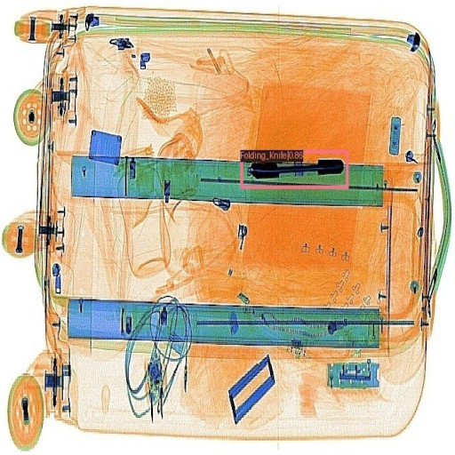
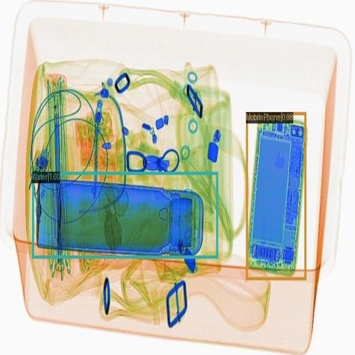
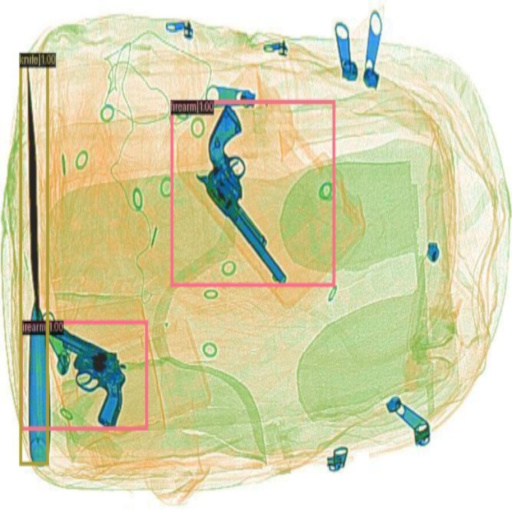
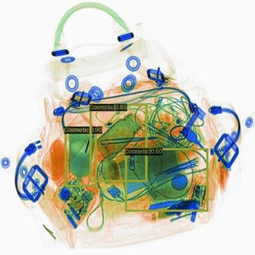

<div align="center">
 

**XrayVision Benchmark: Benchmarking of X-ray Security Imaging Datasets**

---
</div>

**XrayVision Benchmark** aims to provide detection performance metrics for X-ray security screening public datasets, employing state-of-the-art deep learning-based object detection algorithms.

:space_invader: XrayVision benchmack is constantly updated with the latest object detection algorithms, datasets and new features - check in regularly for updates! 

:steam_locomotive: **Hang tight! We're about to drop the model weights and configs soon!** :nerd_face: :hourglass_flowing_sand: 

:owl: *<small>Our epochal mission: Standardise detection performance criteria and consolidate all results on this page - your one-stop-shop for the research community - because who has time to browse a million different places when you're busy changing the world?</small>*

*:boom: <small>[Curious about the mysterious world of X-ray security imaging in Computer Vision? Follow this page for an enlightening journey—where even the machines have to double-check their bags: [Link](https://github.com/NeelBhowmik/xray)]</small>*

<div style="display: flex;">
    
    
    
    
</div>

## :ant: Index
<!-- - <small> [Dataset](#dragon_face-dataset) </small>
- <small> [Object Detection Model](#hotsprings-object-detection-model) </small>
- <small> [Experimental Protocol](#bulb-experimental-protocol) </small>
- <small> [SIXray10](#sixray10) </small>
- <small> [OPIXray](#opixray) </small>
- <small> [HiXray](#hixray) </small>
- <small> [PIDray](#pidray) </small>
- <small> [CLCXray](#clcxray) </small>
- <small> [Reference](#frog-reference) </small> -->

<small> [[Dataset]](#dragon_face-dataset) </small>  <small> [[Object Detection Model]](#hotsprings-object-detection-model) </small>  <small> [[Experimental Protocol]](#bulb-experimental-protocol) </small> <small> [[SIXray10]](#sixray10) </small> <small> [[OPIXray]](#opixray) </small> <small> [[HiXray]](#hixray) </small>  <small> [[PIDray]](#pidray) </small> <small> [[CLCXray]](#clcxray) </small> <small> [[Reference]](#frog-reference) </small> <small> [[Contribute]](#rocket-contribute) </small>

## :dragon_face: Dataset

|Name       | Type | Year | Class |Prohibited - Negative| Annotations| Views|Open Source | 
|-----------|------|------|-------------|-------------|------|-----|------|
|SIXray10  <sup>[[paper]](https://arxiv.org/abs/1901.00303) </sup>   |2D    | 2019 |6            |8,929 - 0 | bbox |1 |<span style="color:green;">✓</span> [[Link]](https://github.com/MeioJane/SIXray) |
|OPIXray <sup>[[paper]](https://arxiv.org/abs/2004.08656) </sup>   |2D    | 2020 |5            |8,885  - 0 | bbox |1     |<span style="color:green;">✓</span>  [[Link]](https://github.com/OPIXray-author/OPIXray)           |
|HiXray  <sup>[[paper]](https://arxiv.org/abs/2108.09917) </sup>     |2D    | 2021 |8            |45,364 - 0 | bbox|1     |<span style="color:green;">✓</span> [[Link]](https://github.com/DIG-Beihang/XrayDetection)  |
|PIDray <sup>[[paper]](https://arxiv.org/abs/2211.10763) </sup>   |2D    | 2022 |12           |47,677 - 0  | bbox, segm|1     |<span style="color:green;">✓</span> [[Link]](https://github.com/bywang2018/security-dataset)       |
|CLCXray   <sup>[[paper]](https://ieeexplore.ieee.org/document/9722843) </sup>     |2D    | 2022 |12            |9,565 - 0 | bbox, segm|1     |<span style="color:green;">✓</span> [[Link]](https://github.com/GreysonPhoenix/CLCXray)  |
<!-- |PIXray       |2D    | 2022 |12            |5,046 - 0 | bbox, segm|1     |<span style="color:green;">✓</span> [[Link]](https://github.com/Mbwslib/DDoAS)  | -->

[<sup>[top]</sup>](#ant-index)

## :hotsprings: Object Detection Model


| Architecture               | Conf./Journal |Key Features | Backbone | Optimiser         | 
| ---------------------------|---------------|--------------|----------|----------------- |
| CR-CNN <sup>[[paper]](https://arxiv.org/abs/1906.09756) </sup> | TPAMI, 2019 |two-stage, anchor-based | ResNet<sub>50</sub> |  SGD               |
| FSAF <sup>[[paper]](https://arxiv.org/abs/1903.00621) </sup>     | CVPR, 2019 |single-stage, anchor-free | ResNet<sub>50</sub> | SGD               | 
| FreeAnchor <sup>[[paper]](https://arxiv.org/abs/1909.02466) </sup>  | NeurIPS, 2019 | single-stage, anchor-based | ResNet<sub>50</sub> | SGD               |
| FCOS <sup>[[paper]](https://arxiv.org/abs/1904.01355) </sup> | ICCV, 2019 | single-stage, anchor-free | ResNet<sub>50</sub> | SGD               | 
| PAA <sup>[[paper]](https://arxiv.org/abs/2007.08103) </sup> | ECCV, 2020 | single-stage, anchor-based | ResNet<sub>50</sub> | SGD           | 
| DDETR <sup>[[paper]](https://arxiv.org/abs/2010.04159) </sup> | ICLR, 2021 | transformer-based, single-stage, anchor-based | ResNet<sub>50</sub> | Adam  |
| TOOD <sup>[[paper]](https://arxiv.org/abs/2108.07755) </sup>  | ICCV, 2021 | single-stage, anchor-based | ResNet<sub>50</sub> | SGD               |


<!-- | CenterNet <sup>[[paper]](https://arxiv.org/abs/1904.07850) </sup> | CVPR, 2019 | single-stage, anchor-based | ResNet<sub>50</sub> | SGD           |  -->
<!-- | FRCNNw/ST <sup>[[paper]](https://arxiv.org/abs/2103.14030) </sup> | ICCV, 2021  | transformer-based, two-stage, anchor-free | Swin-T | AdamW | 30 |      | -->
<!-- | YOLOX <sup>[[paper]](https://arxiv.org/abs/2107.08430) </sup>     | CVPR, 2021  | single-stage, anchor-free |  ResNet<sub>50</sub> | SGD               |  -->

<!-- | Architecture               | Conf./Journal |Key Features | Backbone | Optimiser         | Epochs | Config            |
| ---------------------------|---------------|--------------|----------|----------------- | ------ | ------------- |
| CR-CNN <sup>[[paper]](https://arxiv.org/abs/1906.09756) </sup> | TPAMI, 2019 |two-stage, anchor-based | ResNet<sub>50</sub> |  SGD               | 20     |      |
| FSAF <sup>[[paper]](https://arxiv.org/abs/1903.00621) </sup>     | CVPR, 2019 |single-stage, anchor-free | ResNet<sub>50</sub> | SGD               | 20     |      |
| FreeAnchor <sup>[[paper]](https://arxiv.org/abs/1909.02466) </sup>  | NeurIPS, 2019 | single-stage, anchor-based | ResNet<sub>50</sub> | SGD               | 20     |      |
| FCOS <sup>[[paper]](https://arxiv.org/abs/1904.01355) </sup> | ICCV, 2019 | single-stage, anchor-free | ResNet<sub>50</sub> | SGD               | 20     |      |
| CenterNet <sup>[[paper]](https://arxiv.org/abs/1904.07850) </sup> | CVPR, 2019 | single-stage, anchor-based | ResNet<sub>50</sub> | SGD           | 20     |  |
| PAA <sup>[[paper]](https://arxiv.org/abs/2007.08103) </sup> | ECCV, 2020 | single-stage, anchor-based | ResNet<sub>50</sub> | SGD           | 20     |  |
| DDETR <sup>[[paper]](https://arxiv.org/abs/2010.04159) </sup> | ICLR, 2021 | transformer-based, single-stage, anchor-based | ResNet<sub>50</sub> | Adam  | 50 |      |
| FRCNNw/ST <sup>[[paper]](https://arxiv.org/abs/2103.14030) </sup> | ICCV, 2021  | transformer-based, two-stage, anchor-free | Swin-T | AdamW | 30 |      |
| YOLOX <sup>[[paper]](https://arxiv.org/abs/2107.08430) </sup>     | CVPR, 2021  | single-stage, anchor-free |  ResNet<sub>50</sub> | SGD               | 20     |      |
| TOOD <sup>[[paper]](https://arxiv.org/abs/2108.07755) </sup>  | ICCV, 2021 | single-stage, anchor-based | ResNet<sub>50</sub> | SGD               | 20     |      | -->


[<sup>[top]</sup>](#ant-index)

## :bulb: Experimental Protocol

- The [object detection models](#hotsprings-object-detection-model) are implemented using the [MMDetection framework](https://github.com/open-mmlab/mmdetection). 
- Our experiments stick to the **train set** for that classic touch, and when it's time to flaunt results, they show off on the **test set** (provided by the orginal dataset split) — unless, of course, it is specified.
- All experiments are initialised with weights pretrained on the [COCO dataset](https://cocodataset.org/#home).
- The model performance (**bbox** detection) is evaluated through [MS-COCO metrics](https://cocodataset.org/#detection-eval), with IoU equal to 0.5 (**IoU=0.5**), using **Average Precision (AP) for class-wise**, and **mAP for the overall performance** measurement. 
- More about coco evaluation metrics, follow this [link](https://pyimagesearch.com/2022/05/02/mean-average-precision-map-using-the-coco-evaluator/).

:microscope: **Evaluate your results:** Use the [coco_evaluation.py](https://github.com/NeelBhowmik/xvision-benchmark/tree/main/tools/coco_evaluation.py) script – because who doesn't want metrics so detailed, even Sherlock would be impressed! :detective:

```
python3 tools/coco_evaluation.py --h

options:
  -h, --help           show this help message and exit
  --gtfile GTFILE      ground truth [in coco format] json file path
  --predfile PREDFILE  prediction [in coco format] json file path
  --statpath STATPATH  output directory path to save stats file
  --conf_iou CONF_IOU  confusion matrix iou threahold
```   

[<sup>[top]</sup>](#ant-index)


## SIXray10

:bar_chart: [[dataset statistics]](https://github.com/NeelBhowmik/xvision-benchmark/tree/main/images/SIXray10.png) 

| Model      | mAP   | Firearm | Knife | Wrench | Pliers | Scissors |
|------------|-------|---------|-------|--------|--------|----------|
| CR-CNN     | 0.860 | 0.882   | 0.824 | 0.838  | 0.882  | 0.873    |
| FSAF       | 0.849 | 0.894   | 0.776 | 0.792  | 0.885  | 0.898    |
| FreeAnchor | 0.908 | 0.840   | 0.875 | 0.920  | 0.912  | 0.891    |
| FCOS       | 0.892 | 0.788   | 0.808 | 0.881  | 0.903  | 0.854    |
| PAA        | 0.906 | 0.912   | 0.884 | 0.869  | 0.926  | 0.939    |
| DDETR      | **0.932** | 0.913   | 0.934 | 0.910  | 0.944  | 0.960    |
| TOOD       | 0.898 | 0.851   | 0.893 | 0.921  | 0.915  | 0.896    |


<!-- | CenterNet  | 0.896 | 0.906   | 0.862 | 0.887  | 0.918  | 0.908    | -->
<!-- | FRCNNw/ST  | 0.904 | 0.897   | 0.856 | 0.899  | 0.920  | 0.947    | -->
<!-- | YOLOX      | 0.903 | 0.909   | 0.869 | 0.891  | 0.907  | 0.938    | -->

[<sup>[top]</sup>](#ant-index)
## OPIXray

:bar_chart: [[dataset statistics]](https://github.com/NeelBhowmik/xvision-benchmark/tree/main/images/OPIXray.png)

| Model      | mAP       | Folding | Straight | Scissor | Utility | M-tool |
|------------|-----------|---------|----------|---------|---------|--------|
| CR-CNN     | 0.890     | 0.934   | 0.771    | 0.961   | 0.836   | 0.949  |
| FSAF       | 0.851     | 0.821   | 0.804    | 0.956   | 0.805   | 0.868  |
| FreeAnchor | 0.924     | 0.716   | 0.955    | 0.788   | 0.934   | 0.863  |
| FCOS       | 0.915     | 0.747   | 0.969    | 0.843   | 0.930   | 0.881  |
| PAA        | 0.899     | 0.944   | 0.788    | 0.976   | 0.835   | 0.955  |
| DDETR      | 0.888     | 0.909   | 0.774    | 0.963   | 0.859   | 0.934  |
| TOOD       | **0.933**     | 0.790   | 0.975    | 0.805   | 0.924   | 0.885  |


<!-- | CenterNet  | 0.875     | 0.911   | 0.758    | 0.977   | 0.820   | 0.909  | -->
<!-- | FRCNNw/ST  | **0.915** | 0.945   | 0.842    | 0.977   | 0.854   | 0.959  | -->
<!-- | YOLOX      | 0.896     | 0.908   | 0.801    | 0.974   | 0.859   | 0.935  | -->

[<sup>[top]</sup>](#ant-index)


## HiXray

:bar_chart: [[dataset statistics]](https://github.com/NeelBhowmik/xvision-benchmark/tree/main/images/HiXray.png) 

| Model      | mAP   | Laptop | MobilePhone | Cosmetic | PortableCharger2 | Water | PortableCharger1 | Tablet | NonmetallicLighter |
|------------|-------|--------|-------------|----------|------------------|-------|------------------|--------|--------------------|
| CR-CNN     | 0.831 | 0.982  | 0.969       | 0.630    | 0.930            | 0.917 | 0.943            | 0.956  | 0.320              | 
| FSAF       | 0.837 | 0.983  | 0.967       | 0.638    | 0.939            | 0.923 | 0.950            | 0.962  | 0.337              |
| FreeAnchor | 0.839 | 0.985   | 0.972      | 0.659    | 0.937            | 0.919 | 0.949            | 0.964  | 0.328              |
| FCOS       | 0.817 | 0.981   | 0.970      | 0.614    | 0.932            | 0.911 | 0.943            | 0.956  | 0.225              |
| PAA        | 0.852 | 0.983  | 0.979       | 0.685    | 0.950            | 0.936 | 0.958            | 0.971  | 0.355              |
| DDETR      | **0.860** | 0.984  | 0.981       | 0.706    | 0.960            | 0.938 | 0.968            | 0.972  | 0.376              |
| TOOD       | 0.852 | 0.982   | 0.980      | 0.748    | 0.949            | 0.935 | 0.961            | 0.962  | 0.301             |

<!-- | CenterNet  |  -->
<!-- | FRCNNw/ST  |  -->
<!-- | YOLOX      |  -->

[<sup>[top]</sup>](#ant-index)

## PIDray

:bar_chart: [[dataset statistics]](https://github.com/NeelBhowmik/xvision-benchmark/tree/main/images/PIDray.png) 

*[Reported values are evaluated on {easy/hard/hidden} test sets.]*

| Model      | mAP                   | Baton                  | Pliers                 | Hammer                 | Powerbank              | Scissors               | Wrench                 | Gun                    | Bullet                 | Sprayer                | HandCuffs              | Knife                  | Lighter                |
|------------|------------------------|------------------------|------------------------|------------------------|------------------------|------------------------|------------------------|------------------------|------------------------|------------------------|------------------------|------------------------|------------------------|
| CR-CNN     | .827/.848/.633       | .985/.933/.357       | .999/.965/.916       | .960/.898/.774       | .953/.951/.753       | .958/.926/.735       | .984/.969/.930       | .158/.416/.655       | .945/.873/.332       | .775/.892/.544       | .989/.983/.989       | .379/.630/.479       | .843/.741/.125       |
| FSAF       | .809/.843/.599       | .982/.940/.357       | .999/.970/.890       | .965/.906/.719       | .952/.965/.672       | .924/.931/.621       | .979/.957/.942       | .088/.307/.550       | .950/.909/.264       | .748/.866/.595       | .988/.982/.990       | .279/.615/.474       | .855/.765/.114       |
| FreeAnchor    | .979/.946/.493 | .989/.976/.920 | .987/.929/.831 | .953/.961/.728 | .970/.948/.733 | .986/.976/.976 | .117/.330/.663 | .956/.894/.332 | .845/.883/.596 | .987/.985/.990 | .397/.654/.500 | .829/.748/.146 | .833/.852/.659 |
| FCOS    | .847/.910/.492 | .920/.963/.895 | .844/.878/.745 | .808/.928/.745 | .764/.917/.699 |  .872/.944/.970 | .106/.479/.641 | .808/.866/.316 | .510/.852/.577 | .899/.971/.988 | .229/.619/.364 | .691/.752/.233 | .692/.840/.639 |
| PAA     | .858/.870/.694 | .986/.944/.562 | .996/.980/.923 | .987/.935/.836 | .961/.959/.710 | .970/.959/.800 | .985/.975/.981 | .214/.405/.672 | .971/.904/.361 | .834/.904/.639 | .988/.985/.990 | .537/.700/.535 | .862.789/.322 | 
| DDETR      | .861/.868/.716       | .989/.952/.589       | .999/.983/.941       | .971/.945/.860       | .969/.968/.723       | .970/.968/.845       | .987/.983/.981       | .099/.337/.645       | .966/.877/.384       | .950/.914/.703       | .988/.986/.990       | .578/.724/.537       | .872/.781/.388       |
| TOOD    | .987/.944/.465 | .998/.979/.902 | .988/.946/.845 | .957/.961/.747 | .951/.953/.740 | .982/.972/.979 | .089/.286/.666 |  .966/.903/.395 | .888/.898/.490 | .988/.985/.990 | .345/.654/.471 | .859/.770/.329 | .833/.854/.668 |

<!-- | CenterNet  | .835/.837/.566       | .977/.935/.935       | .990/.975/.914       | .972/.908/.655       | .952/.955/.649       | .967/.933/.649       | .983/.970/.963       | .278/.441/.568       | .891/.748/.207       | .732/.863/.334       | .989/.987/.989       | .439/.605/.362       | .851/.723/.143       | -->
<!-- | FRCNNw/ST  | **.906/.896/.765**       | .988/.976/.717       | .990/.979/.949       | .988/.952/.921       | .969/.978/.835       | .981/.963/.910       | .988/.987/.990       | .506/.579/.756       | .962/.872/.505       | .958/.943/.676       | .988/.986/.990       | .692/.753/.620       | .867/.787/.906       | -->
<!-- | YOLOX      | .879/.883/.695       | .986/.958/.615       | .989/.986/.883       | .969/.943/.826       | .964/.966/.737       | .982/.964/.840       | .958/.987/.978       | .334/.472/.666       | .960/.902/.393       | .905/.928/.676       | .989/.986/.990       | .670/.707/.525       | .846/.795/.213       | -->

[<sup>[top]</sup>](#ant-index)

## CLCXray

:bar_chart: [[dataset statistics]](https://github.com/NeelBhowmik/xvision-benchmark/tree/main/images/CLCXray.png) 

| Model      | mAP   | blade |scissors | knife | dagger | SwissArmyKnife | PlasticBottle | Cans | VacuumCup | GlassBottle | CartonDrinks |Tin    | SprayCans |
|------------|-------|-------|---------|-------|--------|----------------|---------------|------|-----------|-------------|--------------|-------|-----------|
| CR-CNN     | 0.721 | 0.752 | 0.804   | 1.000 | 0.891  | 0.881          | 0.812         | 0.449| 0.927     | 0.209       | 0.823        | 0.725 | 0.383     | 
| FSAF       | 0.726 | 0.759 | 0.797   | 1.000 | 0.891  | 0.877          | 0.829         | 0.499| 0.934     | 0.196       | 0.833        | 0.733 | 0.359     |
| FreeAnchor | 0.720 | 0.769 | 0.771   | 1.000 | 0.891  | 0.881          | 0.826         | 0.504| 0.923     | 0.179       | 0.830        | 0.724 | 0.343     |
| FCOS       | 0.705 | 0.687 | 0.797   | 1.000 | 0.854  | 0.881          | 0.805         | 0.509| 0.914     | 0.148       | 0.835        | 0.739 | 0.288     |
| PAA        | 0.736 | 0.730| 0.809    | 1.000 | 0.891  | 0.881          | 0.836         | 0.540| 0.929     | 0.246       | 0.855        | 0.731 | 0.385     |
| DDETR      | **0.744** | 0.780 | 0.813   | 1.000 | 0.891  | 0.937          | 0.822         | 0.466| 0.932     | 0.288       | 0.843        | 0.724 | 0.430     |
| TOOD       | 0.736 | 0.775 | 0.810   | 1.000 | 0.891  | 0.881          | 0.820         | 0.512| 0.929     | 0.237       | 0.854        | 0.722 | 0.405     |

<!-- | CenterNet  | -->
<!-- | FRCNNw/ST  |  -->
<!-- | YOLOX      |  -->

[<sup>[top]</sup>](#ant-index)

<!-- ## PIXray -->

## :bicyclist: Additional Reading 
- Seeing Through the Data: A Statistical Evaluation of Prohibited Item Detection Benchmark Datasets for X-ray Security Screening [[Paper]](https://openaccess.thecvf.com/content/CVPR2023W/PBVS/html/Isaac-Medina_Seeing_Through_the_Data_A_Statistical_Evaluation_of_Prohibited_Item_CVPRW_2023_paper.html)
  

## :frog: Reference
If you use this repo/results/model weights, please make sure to cite it – give credit where credit's due:
```tex
@inproceedings{isaac23evaluation,
 author = {Isaac-Medina, B.K.S. and Yucer, S. and Bhowmik, N. and Breckon, T.P.},
 title = {Seeing Through the Data: A Statistical Evaluation of Prohibited Item Detection Benchmark Datasets for X-ray Security Screening},
 booktitle = {Proc. Conf. Computer Vision and Pattern Recognition Workshops},
 pages = {524-533},
 year = {2023},
 month = {June},
 publisher = {IEEE/CVF},
 keywords = {x-ray datasets, object detection, airport security, aviation security},
 url = {https://breckon.org/toby/publications/papers/isaac23evaluation.pdf},
 doi = {10.1109/CVPRW59228.2023.00059},
 category = {baggage},
}
```

## :rocket: Contribute

Welcome to our lively repository - and you're invited to join the party! Feel free to contribute! 

Big shoutout to everyone who's already chipped in!

 


Want to include your algorithms/results - create an [issue](https://github.com/NeelBhowmik/xvision-benchmark/issues) or drop us an email @ neelanjan.bhowmik@durham.ac.uk 

Together, we'll make this repo the coolest gathering spot for all things knowledge 📚
