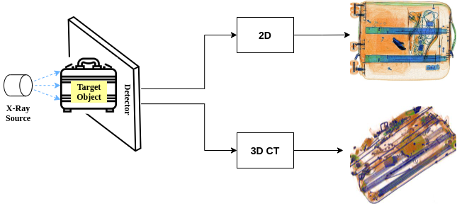

# XVision Benchmark: Benchmarking of X-ray security imaging datasets

<p align="center">
  
</p>

*[List of datasets and papers (not exhaustive)]*

## Dataset

|Name       | Type | Year | Class |Prohibited - Negative| Annotations| Views|Open Source | 
|-----------|------|------|-------------|-------------|------|-----|------|
|FSOD       |2D    | 2022 |20            |12,333 - 0 | bbox|1     |<span style="color:green;">✓</span> [[Link]](https://github.com/DIG-Beihang/XrayDetection)  |
|EDS       |2D    | 2022 |10            |14,219 - 0 | bbox|1     |<span style="color:green;">✓</span> [[Link]](https://github.com/DIG-Beihang/XrayDetection)  |
|Xray-PI       |2D    | 2022 |12            |2,409 - 0 | bbox, mask|1     |<span style="color:green;">✓</span> [[Link]](https://github.com/LPAIS/Xray-PI)  |
|PIXray       |2D    | 2022 |12            |5,046 - 0 | bbox, mask|1     |<span style="color:green;">✓</span> [[Link]](https://github.com/Mbwslib/DDoAS)  |
|CLCXray       |2D    | 2022 |12            |9,565 - 0 | bbox|1     |<span style="color:green;">✓</span> [[Link]](https://github.com/GreysonPhoenix/CLCXray)  |
|HiXray       |2D    | 2021 |8            |45,364 - 0 | bbox|1     |<span style="color:green;">✓</span> [[Link]](https://github.com/DIG-Beihang/XrayDetection)  |
|deei6       |2D    | 2021 |6            |7,022 - 0 | bbox, mask|2     |<span style="color:red;">✕</span> [[Link]](https://breckon.org/toby/publications/papers/bhowmik21energy.pdf)  |
|PIDray    |2D    | 2021 |12           |47,677 - 0  | bbox, mask |1     |<span style="color:green;">✓</span> [[Link]](https://github.com/bywang2018/security-dataset)       |
|AB       |2D    | 2021 |--            |417 - 6,608 | -- |2     |<span style="color:red;">✕</span> [[Link]](https://ieeexplore.ieee.org/document/9534034)  |
|dbf4       |2D    | 2020 |4            |10,112 - 0 | bbox, mask |4     |<span style="color:red;">✕</span> [[Link]](https://breckon.org/toby/publications/papers/isaac20multiview.pdf)  |
|OPIXray    |2D    | 2020 |5            |8,885  - 0 | bbox |1     |<span style="color:green;">✓</span>  [[Link]](https://github.com/OPIXray-author/OPIXray)           |
|SIXray     |2D    | 2019 |6            |8,929 - 1,050,0302 | bbox |1 |<span style="color:green;">✓</span> [[Link]](https://github.com/MeioJane/SIXray)           |
|COMPASS-XP     |2D    | 2019 |366            |1928 - 0 | -- |1 |<span style="color:green;">✓</span> [[Link]](https://zenodo.org/record/2654887#.YUtGVHVKikA)           |
|dbf6       |2D    | 2018 |6            |11,627 - 0 | bbox, mask |4    |<span style="color:red;">✕</span> [[Link]](https://breckon.org/toby/publications/papers/akcay18architectures.pdf)  |
|GDXray       |2D    | 2015 |5            |19,407 - 0 | bbox |1     |<span style="color:green;">✓</span> [[Link]](https://domingomery.ing.puc.cl/material/gdxray/)  |
|Dur_3D       |3D    | 2020 |5            |774 - 0 | bbox | --   |<span style="color:red;">✕</span> [[Link]](https://arxiv.org/abs/2008.01218)  |
|Flitton_3D       |3D    | 2015 |2        |810 - 2149 | bbox | --   |<span style="color:red;">✕</span> [[Link]](https://breckon.org/toby/publications/papers/flitton15codebooks.pdf)  |

---

## OPIXray

[[dataset statistics]](https://github.com/NeelBhowmik/xvision-benchmark/tree/main/images/OPIXray.png)

| Model      | mAP       | Folding | Straight | Scissor | Utility | M-tool |
|------------|-----------|---------|----------|---------|---------|--------|
| CR-CNN     | 0.890     | 0.934   | 0.771    | 0.961   | 0.836   | 0.949  |
| FSAF       | 0.851     | 0.821   | 0.804    | 0.956   | 0.805   | 0.868  |
| DDETR      | 0.888     | 0.909   | 0.774    | 0.963   | 0.859   | 0.934  |
| FRCNNw/ST  | **0.915** | 0.945   | 0.842    | 0.977   | 0.854   | 0.959  |
| YOLOX      | 0.896     | 0.908   | 0.801    | 0.974   | 0.859   | 0.935  |
| CenterNet  | 0.875     | 0.911   | 0.758    | 0.977   | 0.820   | 0.909  |
| FCOS       | 0.915     | 0.747   | 0.969    | 0.843   | 0.930   | 0.881  | 
| TOOD       | 0.933     | 0.790   | 0.975    | 0.805   | 0.924   | 0.885  |
| FreeAnchor | 0.924     | 0.716   | 0.955    | 0.788   | 0.934   | 0.863  |


## SIXray10

[[dataset statistics]](https://github.com/NeelBhowmik/xvision-benchmark/tree/main/images/SIXray10.png)

| Model      | mAP   | Firearm | Knife | Wrench | Pliers | Scissors |
|------------|-------|---------|-------|--------|--------|----------|
| CR-CNN     | 0.860 | 0.882   | 0.824 | 0.838  | 0.882  | 0.873    |
| FSAF       | 0.849 | 0.894   | 0.776 | 0.792  | 0.885  | 0.898    |
| DDETR      | **0.932** | 0.913   | 0.934 | 0.910  | 0.944  | 0.960    |
| FRCNNw/ST  | 0.904 | 0.897   | 0.856 | 0.899  | 0.920  | 0.947    |
| YOLOX      | 0.903 | 0.909   | 0.869 | 0.891  | 0.907  | 0.938    |
| CenterNet  | 0.896 | 0.906   | 0.862 | 0.887  | 0.918  | 0.908    |
| FCOS       | 0.892 | 0.788   | 0.808 | 0.881  | 0.903  | 0.854    |
| TOOD       | 0.898 | 0.851   | 0.893 | 0.921  | 0.915  | 0.896    |
| FreeAnchor | 0.908 | 0.840   | 0.875 | 0.920  | 0.912  | 0.891    |


## PIDray

[[dataset statistics]](https://github.com/NeelBhowmik/xvision-benchmark/tree/main/images/PIDray.png)

| Model      | mAP                   | Baton                  | Pliers                 | Hammer                 | Powerbank              | Scissors               | Wrench                 | Gun                    | Bullet                 | Sprayer                | HandCuffs              | Knife                  | Lighter                |
|------------|------------------------|------------------------|------------------------|------------------------|------------------------|------------------------|------------------------|------------------------|------------------------|------------------------|------------------------|------------------------|------------------------|
| CR-CNN     | .827/.848/.633       | .985/.933/.357       | .999/.965/.916       | .960/.898/.774       | .953/.951/.753       | .958/.926/.735       | .984/.969/.930       | .158/.416/.655       | .945/.873/.332       | .775/.892/.544       | .989/.983/.989       | .379/.630/.479       | .843/.741/.125       |
| FSAF       | .809/.843/.599       | .982/.940/.357       | .999/.970/.890       | .965/.906/.719       | .952/.965/.672       | .924/.931/.621       | .979/.957/.942       | .088/.307/.550       | .950/.909/.264       | .748/.866/.595       | .988/.982/.990       | .279/.615/.474       | .855/.765/.114       |
| DDETR      | .861/.868/.716       | .989/.952/.589       | .999/.983/.941       | .971/.945/.860       | .969/.968/.723       | .970/.968/.845       | .987/.983/.981       | .099/.337/.645       | .966/.877/.384       | .950/.914/.703       | .988/.986/.990       | .578/.724/.537       | .872/.781/.388       |
| FRCNNw/ST  | **.906/.896/.765**       | .988/.976/.717       | .990/.979/.949       | .988/.952/.921       | .969/.978/.835       | .981/.963/.910       | .988/.987/.990       | .506/.579/.756       | .962/.872/.505       | .958/.943/.676       | .988/.986/.990       | .692/.753/.620       | .867/.787/.906       |
| YOLOX      | .879/.883/.695       | .986/.958/.615       | .989/.986/.883       | .969/.943/.826       | .964/.966/.737       | .982/.964/.840       | .958/.987/.978       | .334/.472/.666       | .960/.902/.393       | .905/.928/.676       | .989/.986/.990       | .670/.707/.525       | .846/.795/.213       |
| CenterNet  | .835/.837/.566       | .977/.935/.935       | .990/.975/.914       | .972/.908/.655       | .952/.955/.649       | .967/.933/.649       | .983/.970/.963       | .278/.441/.568       | .891/.748/.207       | .732/.863/.334       | .989/.987/.989       | .439/.605/.362       | .851/.723/.143       |
| FCOS    | .847/.910/.492 | .920/.963/.895 | .844/.878/.745 | .808/.928/.745 | .764/.917/.699 |  .872/.944/.970 | .106/.479/.641 | .808/.866/.316 | .510/.852/.577 | .899/.971/.988 | .229/.619/.364 | .691/.752/.233 | .692/.840/.639 |
| TOOD    | .987/.944/.465 | .998/.979/.902 | .988/.946/.845 | .957/.961/.747 | .951/.953/.740 | .982/.972/.979 | .089/.286/.666 |  .966/.903/.395 | .888/.898/.490 | .988/.985/.990 | .345/.654/.471 | .859/.770/.329 | .833/.854/.668 |
| FreeAnchor    | .979/.946/.493 | .989/.976/.920 | .987/.929/.831 | .953/.961/.728 | .970/.948/.733 | .986/.976/.976 | .117/.330/.663 | .956/.894/.332 | .845/.883/.596 | .987/.985/.990 | .397/.654/.500 | .829/.748/.146 | .833/.852/.659 |


## HiXray

[[dataset statistics]](https://github.com/NeelBhowmik/xvision-benchmark/tree/main/images/HiXray.png)

| Model      | mAP   | Laptop | MobilePhone | Cosmetic | PortableCharger2 | Water | PortableCharger1 | Tablet | NonmetallicLighter |
|------------|-------|--------|-------------|----------|------------------|-------|------------------|--------|--------------------|
| CR-CNN     | 0.831 | 0.982  | 0.969       | 0.630    | 0.930            | 0.917 | 0.943            | 0.956  | 0.320              | 
| FSAF       | 0.837 | 0.983  | 0.967       | 0.638    | 0.939            | 0.923 | 0.950            | 0.962  | 0.337              |
| DDETR      | 0.860 | 0.984  | 0.981       | 0.706    | 0.960            | 0.938 | 0.968            | 0.972  | 0.376              |
| FRCNNw/ST  | 
| YOLOX      | 
| CenterNet  | 
| FCOS       | 0.817 | 0.981   | 0.970      | 0.614    | 0.932            | 0.911 | 0.943            | 0.956  | 0.225              |      
| TOOD       | 0.852 | 0.982   | 0.980      | 0.748    | 0.949            | 0.935 | 0.961            | 0.962  | 0.301              |
| FreeAnchor | 0.839 | 0.985   | 0.972      | 0.659    | 0.937            | 0.919 | 0.949            | 0.964  | 0.328              |


## CLCXray

[[dataset statistics]](https://github.com/NeelBhowmik/xvision-benchmark/tree/main/images/CLCXray.png)

| Model      | mAP   | blade |scissors | knife | dagger | SwissArmyKnife | PlasticBottle | Cans | VacuumCup | GlassBottle | CartonDrinks |Tin    | SprayCans |
|------------|-------|-------|---------|-------|--------|----------------|---------------|------|-----------|-------------|--------------|-------|-----------|
| CR-CNN     | 0.721 | 0.752 | 0.804   | 1.000 | 0.891  | 0.881          | 0.812         | 0.449| 0.927     | 0.209       | 0.823        | 0.725 | 0.383     | 
| FSAF       | 0.726 | 0.759 | 0.797   | 1.000 | 0.891  | 0.877          | 0.829         | 0.499| 0.934     | 0.196       | 0.833        | 0.733 | 0.359     |
| DDETR      | 0.744 | 0.780 | 0.813   | 1.000 | 0.891  | 0.937          | 0.822         | 0.466| 0.932     | 0.288       | 0.843        | 0.724 | 0.430     |
| FRCNNw/ST  | 
| YOLOX      | 
| CenterNet  | 
| FCOS       | 0.705 | 0.687 | 0.797   | 1.000 | 0.854  | 0.881          | 0.805         | 0.509| 0.914     | 0.148       | 0.835        | 0.739 | 0.288     |
| TOOD       | 0.736 | 0.775 | 0.810   | 1.000 | 0.891  | 0.881          | 0.820         | 0.512| 0.929     | 0.237       | 0.854        | 0.722 | 0.405     |
| FreeAnchor | 0.720 | 0.769 | 0.771   | 1.000 | 0.891  | 0.881          | 0.826         | 0.504| 0.923     | 0.179       | 0.830        | 0.724 | 0.343     |


## PIXray


<!-- ## GDXray


## deei6


## dbf6  -->


# :frog: Reference
If you use this repo and like it, use this to cite it:
```tex
@misc{xvision-benchmark,
      title={XVision Benchmark: Benchmarking of X-ray security imaging datasets},
      author={Neelanjan Bhowmik},
      year={2023},
      url={https://github.com/NeelBhowmik/xvision-benchmark}
    }
```
# :rocket: Contribute

Welcome to our lively repository - and you're invited to join the party! Feel free to contribute! 

If you spot a missing paper - create an [issue](https://github.com/NeelBhowmik/xvision-benchmark/issues) or drop us an email @ neelanjan.bhowmik@durham.ac.uk 

Together, we'll make this repo the coolest gathering spot for all things knowledge 📚
